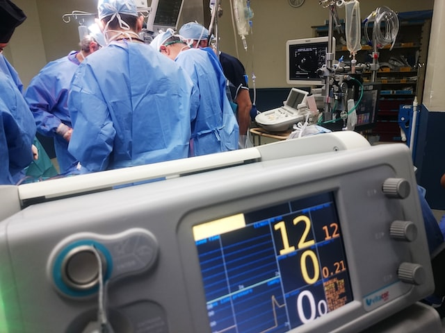
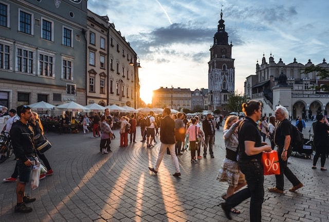

---
layout: splash
permalink: /
favicon: favicon.png
classes:
  - landing
  - dark-theme
  - wide
header:
  overlay_color: "#000"
  overlay_filter: "0.5"
  overlay_image: /assets/images/unsplash-image-1.jpg
  caption: "Photo credit: [**Unsplash**](https://unsplash.com)"
excerpt: "Trials Supported By Smart Networks Beyond 5G."

--- 
**Motivation**\: Smart Cities have already attracted attention as one of the possible solutions to improve “livability” and people’s quality of life. Beyond 5G and 6G are candidate technologies to positively impact aspects of immense social value as sustainability, resilience, inclusion, trust, security, etc.'

**Vision**\: TrialsNet vision is to enable the realization of compelling societal values through the implementation of 5G and beyond applications, which will be propaedeutic for the transition towards the next generation of mobile networks.

**Goal**\: TrialsNet will deploy full large-scale trials to implement a heterogenous and comprehensive set of innovative 6G applications based on various technologies such as Cobots, Metaverse, massive twinning, Internet of Senses, and others, covering three relevant domains of the urban ecosystems in Europe identified as i) Infrastructure, Transportation, Security & Safety, ii) eHealth & Emergency, and iii) Culture, Tourism & Entertainment

# TrialsNet domains

  

# News and Event





<a class="twitter-timeline" href="https://twitter.com/trialsnet?ref_src=twsrc%5Etfw">Tweets by trialsnet</a> 

<!--



-->
